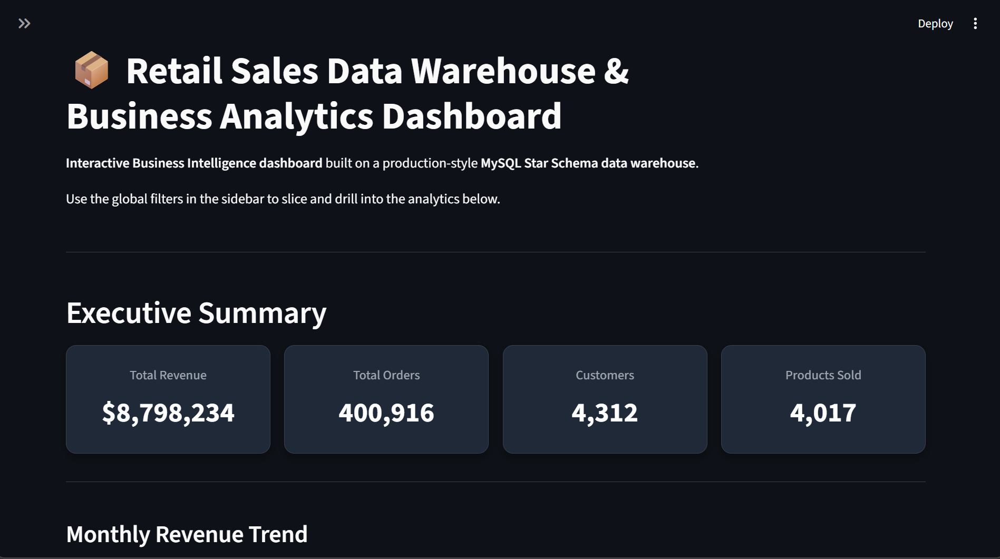
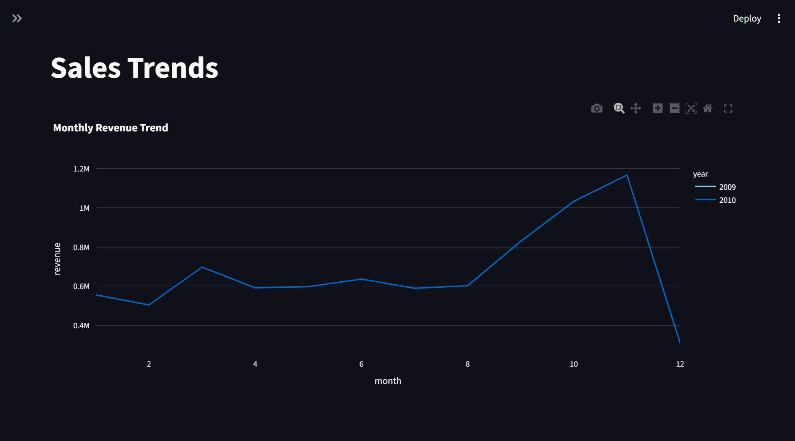
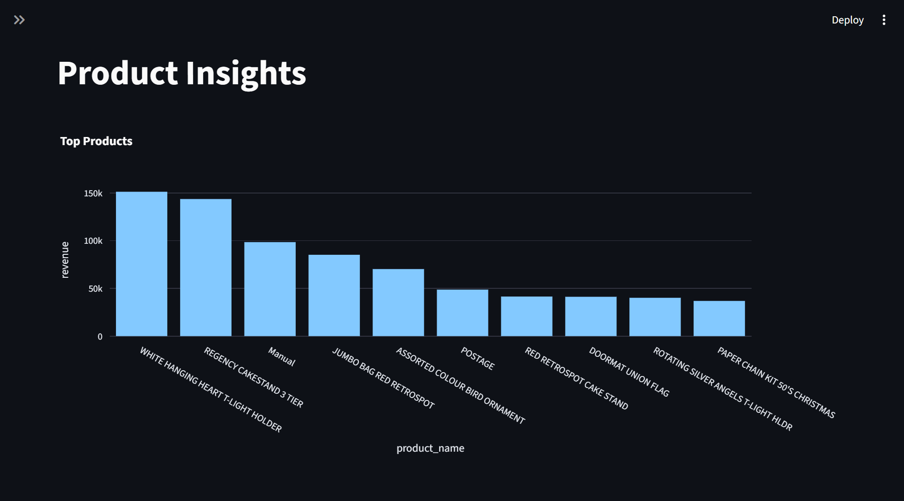
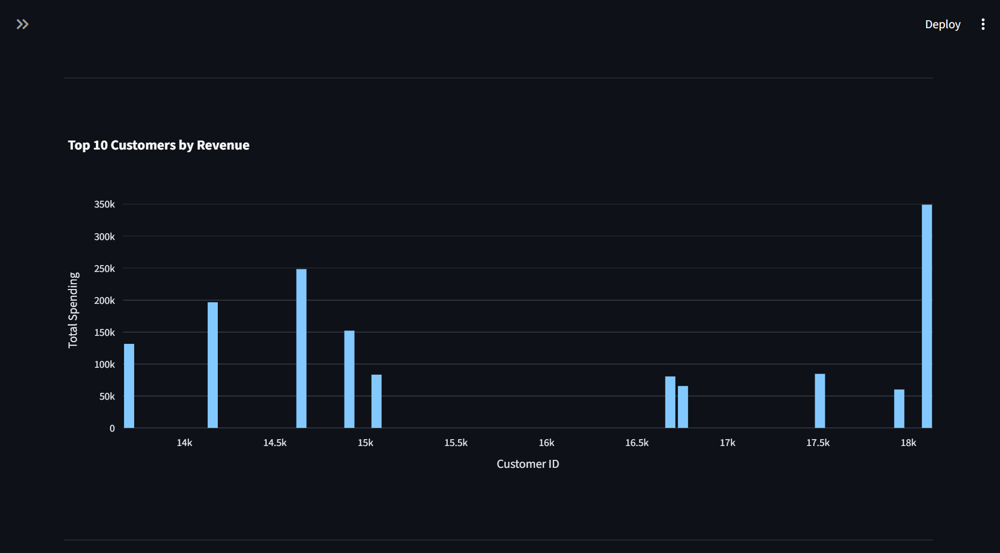
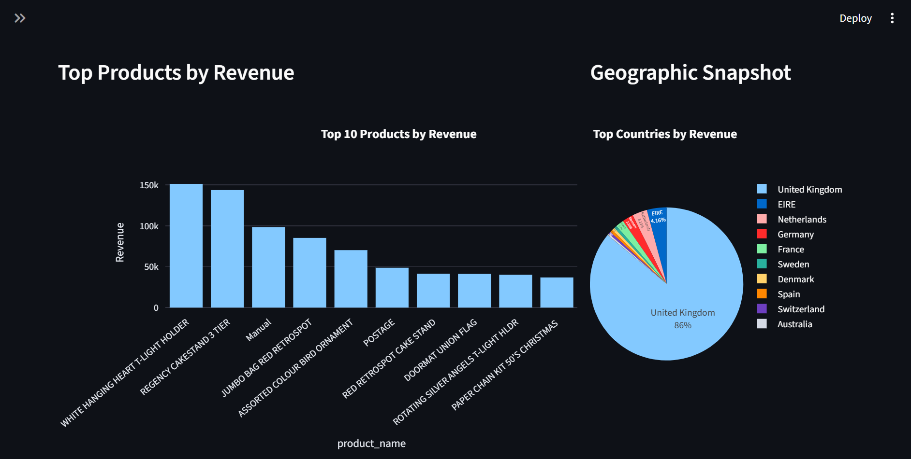

---

# Retail Sales Data Warehouse & Business Intelligence Dashboard

A complete **end-to-end data warehousing and analytics project** that builds a **Retail Sales Data Warehouse** using MySQL and provides **interactive business intelligence dashboards** using Streamlit.

The project demonstrates the full data pipeline from **raw transactional data → ETL processing → data warehouse (Star Schema) → SQL analytics → interactive dashboard**.

This system enables business users to explore **sales performance, customer behavior, product insights, and geographic trends** through an interactive analytics interface.

---

## Project Overview

Modern organizations rely on **data warehouses and business intelligence systems** to transform raw data into actionable insights.

This project simulates a **real-world retail analytics platform** by implementing:

- Data ingestion from raw retail transaction data
- Data cleaning and transformation using Python
- Dimensional modeling using **Star Schema**
- ETL pipeline to populate a MySQL data warehouse
- Analytical SQL queries for business insights
- Interactive multi-page BI dashboard using Streamlit

The system answers questions such as:

- What is the total revenue generated?
- Which products generate the most sales?
- Which customers contribute the highest revenue?
- Which countries generate the most revenue?
- How do sales trends change over time?

---

## Project Architecture

		Raw Dataset (CSV)
		       │
		       ▼
	Exploratory Data Analysis (Python)
		       │
		       ▼
	 Data Cleaning & Transformation
		       │
		       ▼
	  ETL Pipeline (Python)
 		       │
 		       ▼
	MySQL Data Warehouse (Star Schema)
 		       │
 		       ▼
      SQL Analytics Queries
 		       │
 		       ▼
	Streamlit Interactive Dashboard


---

## Technology Stack

| Category | Technology |
|--------|-------------|
| Programming Language | Python |
| Database | MySQL |
| Data Processing | Pandas |
| Visualization | Plotly |
| Dashboard Framework | Streamlit |
| Version Control | Git |
| Environment Management | Python venv |
| Data Source | Kaggle Retail Dataset |

---

## Dataset

Dataset used: **Online Retail Dataset**

Source: `https://www.kaggle.com/datasets/lakshmi25npathi/online-retail-dataset/`

The dataset contains transactional records from a UK-based online retail store.

Key attributes include:

- Invoice Number
- Product Code
- Product Description
- Quantity
- Invoice Date
- Unit Price
- Customer ID
- Country

Dataset Size:

- Raw rows: **525,461**
- Cleaned rows: **400,916**

---

## Data Warehouse Design

The warehouse uses a **Star Schema** to support efficient analytical queries.

### Fact Table

#### sales_fact

| Column | Description |
|------|-------------|
| sale_id | Primary key |
| product_id | Foreign key to product_dimension |
| customer_id | Foreign key to customer_dimension |
| date_id | Foreign key to date_dimension |
| quantity | Quantity sold |
| revenue | Sales revenue |

---

### Dimension Tables

#### product_dimension

| Column | Description |
|------|-------------|
| product_id | Primary key |
| stock_code | Product identifier |
| product_name | Product description |

---

#### customer_dimension

| Column | Description |
|------|-------------|
| customer_id | Primary key |
| country | Customer country |

---

#### date_dimension

| Column | Description |
|------|-------------|
| date_id | Primary key |
| date | Calendar date |
| day | Day of month |
| month | Month |
| year | Year |

---

## ETL Pipeline

The ETL pipeline performs the following steps:

---

### Extract

Raw dataset is loaded from CSV using Pandas.
`raw_retail_sales_data.csv`

---

### Transform

Data cleaning rules applied:

- Remove rows where **CustomerID is missing**
- Remove **negative quantity transactions (returns)**
- Remove **invalid prices**
- Create **Revenue column**
`Revenue = Quantity × UnitPrice`
- Additional features generated:
`Year`
`Month`
`Day`

---

### Load

Cleaned data is loaded into MySQL warehouse using python loader:
`04_etl_loader.py`

---

## Final warehouse size:

| Table | Records |
|------|---------|
| product_dimension | 4472 |
| customer_dimension | 4312 |
| date_dimension | 307 |
| sales_fact | 400,916 |

---

## Analytical SQL Queries

The warehouse supports multiple analytical queries including:

### Revenue Analytics

- Total Revenue
- Average Order Value
- Highest Transaction Value

### Product Analytics

- Top selling products
- Least selling products
- Product revenue distribution

### Customer Analytics

- Top customers by revenue
- Customer purchase frequency
- Customer spending distribution

### Geographic Analytics

- Revenue by country
- Customer distribution by region

### Time Series Analytics

- Daily revenue trends
- Monthly revenue trends
- Yearly revenue growth

Total queries implemented: **30+ analytical queries**

---

## Interactive Dashboard

The Streamlit dashboard provides **interactive business intelligence visualization**.

Dashboard Features:

- Global filters (Year, Country, Product)
- KPI summary cards
- Multi-page navigation
- Interactive charts
- Real-time database queries

---

## Dashboard Pages

---

### Overview:

Provides high-level business metrics:

- Total Revenue
- Total Orders
- Total Customers
- Products Sold

Includes:

- Revenue trend chart
- Top products chart

---

### Sales Trends:

Shows time-based analytics:

- Monthly revenue trend
- Sales growth over time

---

### Product Insights:

Product-level analysis:

- Top selling products
- Product revenue comparison

---

### Customer Insights:

Customer behavior analytics:

- Top customers
- Customer spending patterns

---

### Geographic Insights:

Regional performance analysis:

- Revenue by country
- Geographic sales distribution

---

## Dashboard Screenshots

---

### Dashboard Overview



---

### Sales Trends



---

### Product Insights



---

### Customer Insights



---

### Geographic Insights



---

## Project Folder Structure

```
retail_sales_insights_dashboard/
│
├── data/
│   ├── raw_retail_sales_data.csv
│   └── cleaned_data.csv
|   └── transformed_data.csv
│
├── scripts/
│   ├── 01_exploratory_data_analysis_eda.py
│   ├── 02_data_cleaning.py
│   └── 03_data_transformation.py
│   └── 04_etl_loader.py
│
├── warehouse/
│   └── star_schema.sql
│
├── analytics/
│   └── queries.sql
│
├── dashboard/
│   ├── components/
│   │	└── kpi_cards.py
│   ├── pages/
│   │	├── 1_Overview.py
│   │	├── 2_Sales_Trends.py
│   │	├── 3_Product_Insights.py
│   │	├── 4_Customer_Insights.py
│   │	└── 5_Geographic_Insights.py
│   ├── utils/
│   │	├── db_connection.py
│   │	├── filters.py
│   │	└── queries.py
│   └── app.py
│
├── requirements.txt
│
├── .gitignore
│
└── .env
```

---

## ⚙️ Installation & Setup

---

### 1. Clone the repository in the project folder:

```bash
git clone https://github.com/rohit-1024/Retail-Sales-Insights-Dashboard.git
```

---

### 2. Create a Python virtual environment using:

```bash
python -m venv .venv
```

---

### 3. Activate the Python virtual environment (windows):

```bash
.venv\Scripts\activate
```

---

### 4. Install dependencies:

```bash
pip install -r requirements.txt
```

---

### 5. Setup the data warehouse (MySQL database):

In MySQL workbench, run:

```bash
warehouse/star_schema.sql
```

---

### 6. Add a '.gitignore` file:

```bash
.venv/
__pycache__/
*.pyc
.env
```

---

### 7. Create a '.env' file with your database credentials:

```bash
DB_HOST = localhost
DB_PORT = 3306
DB_USER = your_username
DB_PASSWORD = your_password
DB_NAME = retail_dw
```

---

### 8. Run all the scripts in `scripts`:

```bash
python 01_exploratory_data_analysis_eda.py
python 02_data_cleaning.py
python 03_data_transformation.py
python 04_etl_loader.py
```

This will populate the warehouse tables

---

### 9. Launch streamlit dashboard:

```bash
streamlit run dashboard/app.py
```

The dashboard will open automatically in your browser at `http://localhost:8501/`

---

## Key Skills Demonstrated

This project demonstrates skills in:

- Data Warehousing
- Dimensional Modeling
- ETL Pipeline Development
- SQL Analytics
- Python Data Processing
- Business Intelligence Dashboard Development
- Data Visualization
- Modular Software Architecture

---

## Project Use Cases

This system can be used for:

- Retail sales performance analysis
- Customer behavior analysis
- Product demand analysis
- Geographic sales insights
- Business decision support

---

## 🤝 Contribution
Contributions are welcome!
Feel free to fork this repo and submit pull requests.

---

## 📜 License
This project is licensed under the **MIT License**.

---

## 👨‍💻 Author
- **Rohit Raut**
- 📧 [rohit.it4368@gmail.com](mailto:rohit.it4368@gmail.com)
- 🔗 [LinkedIn](https://www.linkedin.com/in/rohitraut1024/)

---
